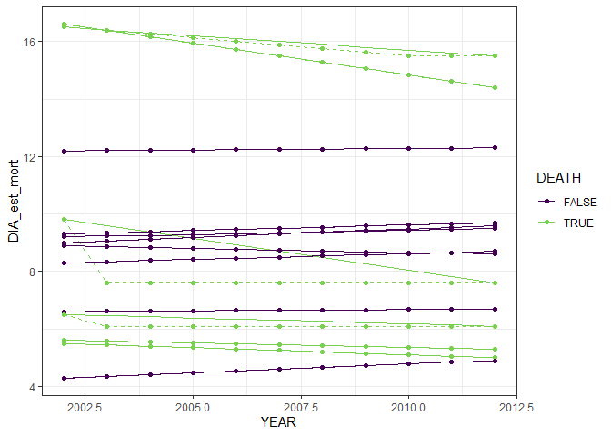

# Annualized estimates taking into account mortality


``` r
source(here::here("R", "query_tables_db_fxns.R"))
source(here::here("R", "query_annualized.R"))

con <- connect_to_tables(here::here("data", "db", "foresttime-to-share.duckdb"))
```

``` r
az_nfs_annualized <- query_annualized(con,
                                      conditions = create_conditions(
                                        STATECD == 4,
                                        OWNCD == 11,
                                        MULTI_OWNCD_FLAG == FALSE,
                                        MULTI_ADFORCD_FLAG == FALSE
                                      ),
                                      variables = c("DIA_est", "HT_est", "ACTUALHT_est", "DIA_est_mort", "HT_est_mort", "ACTUALHT_est_mort", "YEAR", "ADFORCD", "SPCD_CORR", "SPCD_FLAG", "STATUSCD", "DIES"))
```

This plot illustrates annual estimates of tree diameter taking into
account mortality. For trees that die and have a MORTYR recorded, I
recalculated the interpolated diameter estimates assuming they stopped
changing in diameter in MORTYR. This is shown in the dotted lines on the
graph and how they diverge from the solid lines. Note that some trees
die and do not have MORTYR recorded, or have a MORTYR that is the same
as the last INVYR. For these trees, the diameter estimates do not change
whether or not you take into account MORTYR.

    Warning: package 'ggplot2' was built under R version 4.3.3



``` r
dbDisconnect(con, shutdown = TRUE)
```
