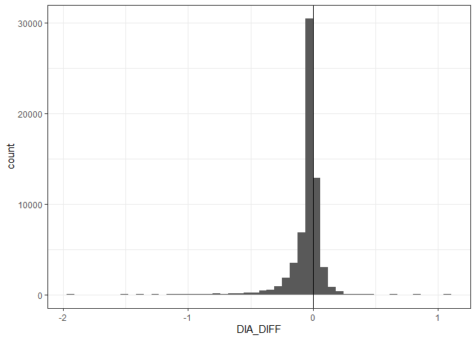
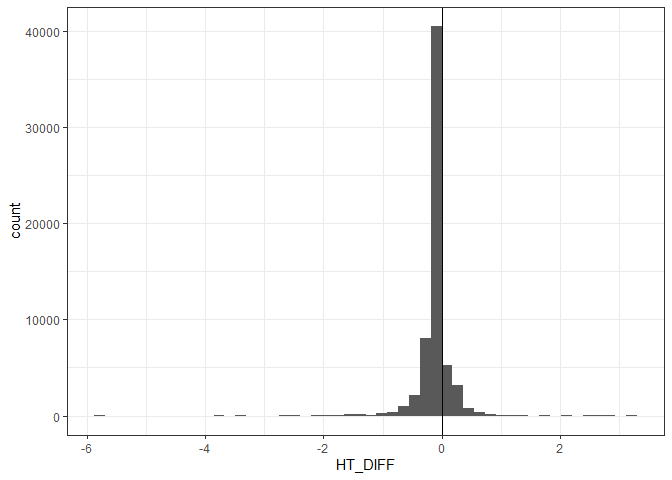
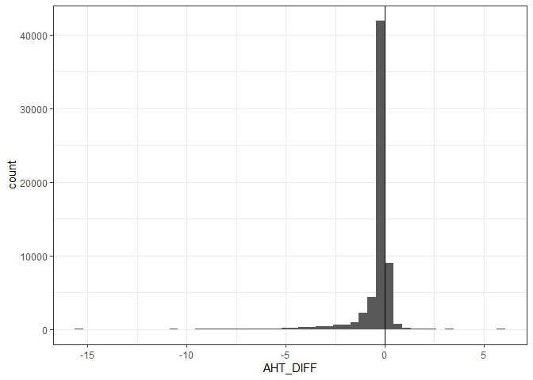
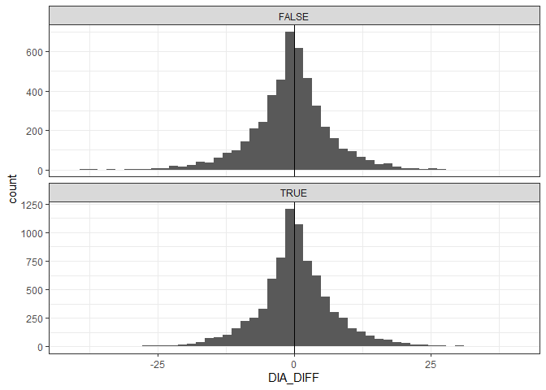
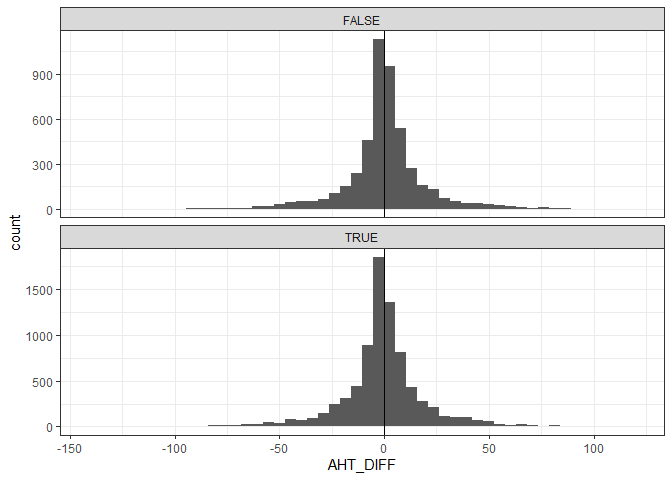
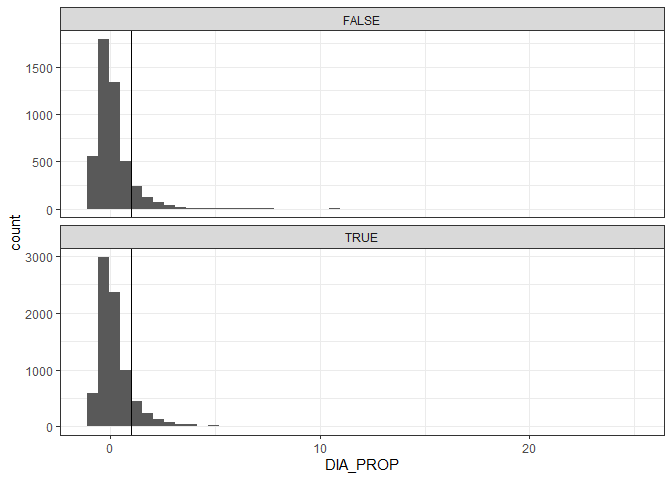
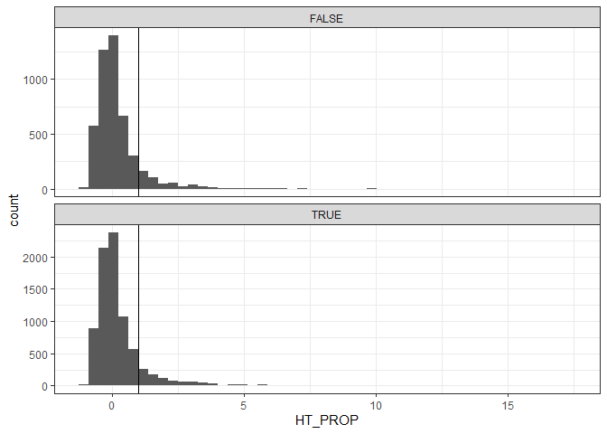
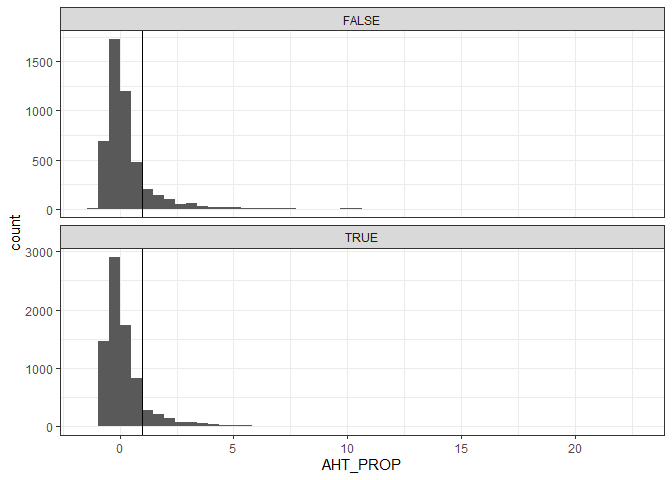
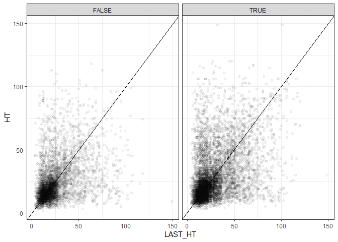
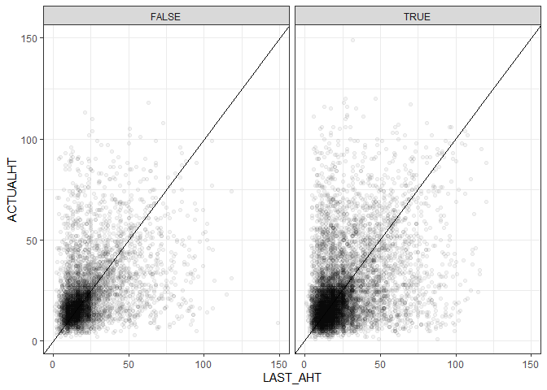

# Trees shrink


# Context

After the 4/17 meeting, I (Renata) was curious about instances where
trees appear to shrink over time. This could be “true”, measurement
error, or something else. This document is me digging deeper into those
records. Specifically, I checked:

- That shrinking is occurring in the right direction in time (i.e. the
  years aren’t reversed or something). **This checked out**.
- Whether shrinking seems to be associated with trees dying. **About 1/3
  of the times a tree shrank, it also was marked dead.**
- Whether shrinking seems to be associated with disturbance. **Another
  ~1/3 of the time, a tree had a damage or disturbance code when it
  shrank.**
- The magnitude of shrinking - small or large decreases in size?
  **Fairly qualitatively, I don’t see an association between
  death/distrubance/damage and larger decreases in size. And there are
  some pretty big decreases in size not associated with any of those
  explanations.**

``` r
library(ggplot2)
```

    Warning: package 'ggplot2' was built under R version 4.3.3

``` r
source(here::here("R", "query_tables_db_fxns.R"))
```

    Warning: package 'duckdb' was built under R version 4.3.3

    Loading required package: DBI

    Warning: package 'DBI' was built under R version 4.3.2

    Warning: package 'dplyr' was built under R version 4.3.2


    Attaching package: 'dplyr'

    The following objects are masked from 'package:stats':

        filter, lag

    The following objects are masked from 'package:base':

        intersect, setdiff, setequal, union

``` r
source(here::here("R", "query_annualized.R"))
```

# Pulling records

``` r
con <- connect_to_tables(here::here("data", "db", "foresttime-to-share.duckdb"))
```

``` r
az_nfs <- query_annualized(
  con,
  conditions = create_conditions(
    STATECD == 4,
    OWNCD == 11,
    MULTI_OWNCD_FLAG == FALSE,
    MULTI_ADFORCD_FLAG == FALSE
  ),
  variables = c(
    "LAT",
    "LON",
    "DIA_est",
    "HT_est",
    "ACTUALHT_est",
    "YEAR",
    "OWNCD",
    "ADFORCD",
    "SPCD_CORR",
    "SPCD_FLAG",
    "STATUSCD"
  )
)
```

    Joining with `by = join_by(TREE_COMPOSITE_ID)`
    Joining with `by = join_by(TREE_COMPOSITE_ID, SPCD_CORR, TREE_CN)`
    Joining with `by = join_by(PLOT_COMPOSITE_ID, PLOT, STATECD, COUNTYCD, PLT_CN, INVYR, CYCLE)`
    Joining with `by = join_by(PLOT_COMPOSITE_ID, PLOT, STATECD, COUNTYCD, PLT_CN, CONDID, INVYR, CYCLE, UNITCD, SUBCYCLE)`

## Look for shrinking trees

``` r
changes <- az_nfs |>
  group_by(TREE_COMPOSITE_ID) |>
  arrange(YEAR) |>
  mutate(LAST_YEAR = lag(YEAR),
         DIA_DIFF = DIA_est - lag(DIA_est),
         HT_DIFF = HT_est - lag(HT_est),
         AHT_DIFF = ACTUALHT_est - lag(ACTUALHT_est)) |>
  ungroup() |>
  
  arrange(TREE_COMPOSITE_ID, YEAR)

shrinking <- changes |> 
  filter(DIA_DIFF < 0 |
           HT_DIFF < 0 |
           AHT_DIFF < 0) 
```

``` r
theme_set(theme_bw())
ggplot(shrinking, aes(DIA_DIFF)) +
  geom_histogram(bins = 50, boundary = 0) +
  geom_vline(xintercept = 0)
```



``` r
ggplot(shrinking, aes(HT_DIFF)) +
  geom_histogram(bins = 50, boundary = 0) +
  geom_vline(xintercept = 0)
```



``` r
ggplot(shrinking, aes(AHT_DIFF)) +
  geom_histogram(bins = 50, boundary = 0) +
  geom_vline(xintercept = 0)
```



``` r
trees_that_ever_shrink <- shrinking$TREE_COMPOSITE_ID |> unique()

when_the_trees_shrank <- shrinking |>
  select(TREE_COMPOSITE_ID, INVYR) |> 
  distinct()

tree_records <- query_tree_surveys(con = con,
                                   conditions = create_conditions(TREE_COMPOSITE_ID %in% trees_that_ever_shrink),
                                   variables = c("DIA", "ACTUALHT", "HT", "STATUSCD", "ANY_SPCD_FLAG", 
                                                 "DAMAGE_AGENT_CD1",
                                                 "DAMAGE_AGENT_CD2",
                                                 "DAMAGE_AGENT_CD3",
                                                 "DSTRBCD1",
                "DSTRBCD2",
                "DSTRBCD3")) |>
  arrange(INVYR) |>
  mutate(DIA_DIFF = DIA - lag(DIA),
         HT_DIFF = HT - lag(HT),
         AHT_DIFF = ACTUALHT - lag(ACTUALHT),
         LAST_DIA = lag(DIA),
         LAST_HT = lag(HT),
         LAST_AHT = lag(ACTUALHT)) |>
  right_join(when_the_trees_shrank)
```

    Joining with `by = join_by(TREE_COMPOSITE_ID, PLOT_COMPOSITE_ID, PLOT, SUBP, STATECD, COUNTYCD)`
    Joining with `by = join_by(TREE_COMPOSITE_ID, SPCD_CORR, TREE_CN, INVYR, STATUSCD, SPCD, CYCLE)`
    Joining with `by = join_by(PLOT_COMPOSITE_ID, PLOT, STATECD, COUNTYCD, PLT_CN, INVYR, UNITCD, CYCLE, SUBCYCLE)`
    Joining with `by = join_by(PLOT_COMPOSITE_ID, PLOT, STATECD, COUNTYCD, PLT_CN, INVYR, UNITCD, CONDID, CYCLE, SUBCYCLE)`
    Joining with `by = join_by(TREE_COMPOSITE_ID, INVYR)`

``` r
status_cd_when_shrank <- tree_records |>
  group_by(STATUSCD) |>
  tally()

status_cd_when_shrank
```

    # A tibble: 2 × 2
      STATUSCD     n
         <dbl> <int>
    1        1  9015
    2        2  3805

``` r
damage_dist_when_shrank <- tree_records |>
  mutate(across(contains("DAMAGE"), \(x) ifelse(is.na(x), 0, x))) |>
  mutate(across(contains("DAMAGE"), as.numeric)) |>
  mutate(HAS_DAMAGE = (DAMAGE_AGENT_CD1 + DAMAGE_AGENT_CD2 + DAMAGE_AGENT_CD3) > 0) |>
  mutate(across(contains("DSTRBCD"), \(x) ifelse(is.na(x), 0, x))) |>
  mutate(across(contains("DSTRBCD"), as.numeric)) |>
  mutate(IS_DISTURBED = (DSTRBCD1 + DSTRBCD2 + DSTRBCD3) > 0) |>
  mutate(dead_damaged_disturbed = ((STATUSCD == 2) + HAS_DAMAGE + IS_DISTURBED) > 0)

damage_dist_when_shrank |>
  group_by(HAS_DAMAGE, STATUSCD, IS_DISTURBED) |>
  tally()
```

    # A tibble: 6 × 4
    # Groups:   HAS_DAMAGE, STATUSCD [3]
      HAS_DAMAGE STATUSCD IS_DISTURBED     n
      <lgl>         <dbl> <lgl>        <int>
    1 FALSE             1 FALSE         4764
    2 FALSE             1 TRUE           727
    3 FALSE             2 FALSE         1989
    4 FALSE             2 TRUE          1816
    5 TRUE              1 FALSE         2708
    6 TRUE              1 TRUE           816

``` r
damage_dist_when_shrank |> 
  group_by(dead_damaged_disturbed) |>
  tally()
```

    # A tibble: 2 × 2
      dead_damaged_disturbed     n
      <lgl>                  <int>
    1 FALSE                   4764
    2 TRUE                    8056

3805 of 12820 incidents of shrinking coincide with being a dead tree.

3524 of 12820 incidents coicide with at least one DAMAGE code.

Another 727 are alive, undamaged, but marked as DISTURBED in some way.

That stills leaves about 40% of instances where the tree is alive, not
recorded as damaged, and shrinks on at least one measure (ht, actualht,
dia).

``` r
ggplot(damage_dist_when_shrank, aes(DIA_DIFF)) +
  geom_histogram(boundary = 0, bins = 50) +
  facet_wrap(vars(dead_damaged_disturbed), scales = "free_y", ncol = 1) +
  geom_vline(xintercept = 0)
```

    Warning: Removed 45 rows containing non-finite outside the scale range
    (`stat_bin()`).



``` r
ggplot(damage_dist_when_shrank, aes(HT_DIFF)) +
  geom_histogram(boundary = 0, bins = 50) +
  facet_wrap(vars(dead_damaged_disturbed), scales = "free_y", ncol = 1) +
  geom_vline(xintercept = 0)
```

    Warning: Removed 45 rows containing non-finite outside the scale range
    (`stat_bin()`).


``` r
ggplot(damage_dist_when_shrank, aes(AHT_DIFF)) +
  geom_histogram(boundary = 0, bins = 50) +
  facet_wrap(vars(dead_damaged_disturbed), scales = "free_y", ncol = 1) +
  geom_vline(xintercept = 0)
```

    Warning: Removed 45 rows containing non-finite outside the scale range
    (`stat_bin()`).



``` r
mean(damage_dist_when_shrank$ANY_SPCD_FLAG)
```

    [1] 0.04547582

About 5% of these trees have a SPCD_FLAG.

# Really big jumps

``` r
tree_records_prop <- damage_dist_when_shrank |>
  mutate(DIA_PROP = DIA_DIFF / LAST_DIA,
         HT_PROP = HT_DIFF / LAST_HT,
         AHT_PROP = AHT_DIFF / LAST_AHT)

ggplot(tree_records_prop, aes(DIA_PROP)) +
  geom_histogram(boundary = 1, bins = 50) +
  facet_wrap(vars(dead_damaged_disturbed), scales = "free_y", ncol = 1) +
  geom_vline(xintercept = 1)
```

    Warning: Removed 45 rows containing non-finite outside the scale range
    (`stat_bin()`).



``` r
ggplot(tree_records_prop, aes(HT_PROP)) +
  geom_histogram(boundary = 1, bins = 50) +
  facet_wrap(vars(dead_damaged_disturbed), scales = "free_y", ncol = 1) +
  geom_vline(xintercept = 1)
```

    Warning: Removed 45 rows containing non-finite outside the scale range
    (`stat_bin()`).



``` r
ggplot(tree_records_prop, aes(AHT_PROP)) +
  geom_histogram(boundary = 1, bins = 50) +
  facet_wrap(vars(dead_damaged_disturbed), scales = "free_y", ncol = 1) +
  geom_vline(xintercept = 1)
```

    Warning: Removed 45 rows containing non-finite outside the scale range
    (`stat_bin()`).



``` r
ggplot(damage_dist_when_shrank, aes(LAST_DIA, DIA)) +
  geom_point(alpha = .05) +
  geom_abline(slope = 1, intercept = 0) +
  facet_wrap(vars(dead_damaged_disturbed))
```

    Warning: Removed 45 rows containing missing values or values outside the scale range
    (`geom_point()`).


``` r
ggplot(damage_dist_when_shrank, aes(LAST_HT, HT)) +
  geom_point(alpha = .05) +
  geom_abline(slope = 1, intercept = 0) +
  facet_wrap(vars(dead_damaged_disturbed))
```

    Warning: Removed 45 rows containing missing values or values outside the scale range
    (`geom_point()`).



``` r
ggplot(damage_dist_when_shrank, aes(LAST_AHT, ACTUALHT)) +
  geom_point(alpha = .05) +
  geom_abline(slope = 1, intercept = 0) +
  facet_wrap(vars(dead_damaged_disturbed))
```

    Warning: Removed 45 rows containing missing values or values outside the scale range
    (`geom_point()`).



# Clean up

``` r
dbDisconnect(con, shutdown = TRUE)
```
